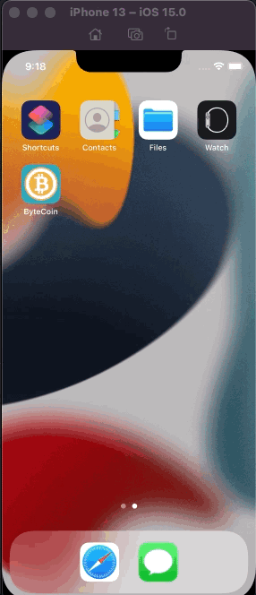

#  Tips Challenge

## Challenge changelog:
* UIPickerView 
* Delegate pattern.
* Swift protocols and extensions. 
* Swift computed properties.
* Swift closures and completion handlers.
* internal and external parameter names
* Learn to use URLSession to network and make HTTP requests.
* Parse JSON with the native Encodable and Decodable protocols + typealias Codable. 
* Learn to use Grand Central Dispatch to fetch the main thread. (DispatchQueue)