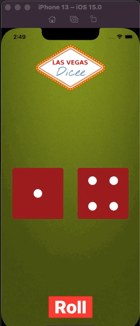

# PersonalCard

## Goal

Recreate Dicee App in Swift UI

## Changelog

* Create an app with functionality (Button)
* More practice creating layouts
* Work with Spacers and padding
* Create Subviews with properties that can change
* Learn about how SwiftUI manages State (@State)