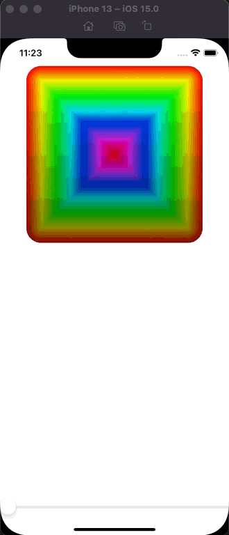

# Drawing


> AnimatableData for the arrow stoke and RoundedRect - Metal rendering with drawingGroup()

## Drawing concepts and samples
* Path
  <details>
    <summary>Create a Triangle with rounded strokes using Path</summary>

    ```swift
    struct ContentView: View {
          var body: some View {
              Path { path in
                  path.move(to: CGPoint(x: 200, y: 100))
                  path.addLine(to: CGPoint(x: 100, y: 300))
                  path.addLine(to: CGPoint(x: 300, y: 300))
                  path.addLine(to: CGPoint(x: 200, y: 100))
                  // no longer needed since the lines have rounded stroke
                  // path.closeSubpath() // close the last path connection
              }
              // .fill(.blue)
              // .stroke(.blue, lineWidth: 10)
              .stroke(.blue, style: StrokeStyle(lineWidth: 10, lineCap: .round, lineJoin: .round))
          }
      }
    ```
  </details>

* Shape
  <details>
    <summary>Create a Triangle with rounded strokes using Tringle struct conforming to Shape Protocol</summary>

    ```swift
    struct Triangle: Shape {
          func path(in rect: CGRect) -> Path {
              var path = Path()

              path.move(to: CGPoint(x: rect.midX, y: rect.minY))
              path.addLine(to: CGPoint(x: rect.minX, y: rect.maxY))
              path.addLine(to: CGPoint(x: rect.maxX, y: rect.maxY))
              path.addLine(to: CGPoint(x: rect.midX, y: rect.minY))

              return path
          }
      }

      struct ContentView: View {
          var body: some View {
              Triangle()
                  // .fill(.red)
                  .stroke(.red, style: StrokeStyle(lineWidth: 10, lineCap: .round, lineJoin: .round))
                  .frame(width: 300, height: 300)
          }
      }
    ```
  </details>

  <details>
    <summary>Create an Arc using Arc struct conforming to Shape Protocol</summary>

    ```swift
    struct Arc: Shape {
          var startAngle: Angle
          var endAngle: Angle
          var clockwise: Bool

          func path(in rect: CGRect) -> Path {
              // NOTE: incorrect arc
      //        var path = Path()
      //        path.addArc(center: CGPoint(x: rect.midX, y: rect.midY), radius: rect.width / 2, startAngle: startAngle, endAngle: endAngle, clockwise: clockwise)

            // NOTE: correct way to handle the arc configuration
            // In the eyes of SwiftUI 0 degrees is not straight upwards, but instead directly to the right.
            // Shapes measure their coordinates from the bottom-left corner rather than the top-left corner, which means SwiftUI goes the other way around from one angle to the other. This is, in my not very humble opinion, extremely alien.
              let rotationAdjustment = Angle.degrees(90)
              let modifiedStart = startAngle - rotationAdjustment
              let modifiedEnd = endAngle - rotationAdjustment
              
              var path = Path()
              path.addArc(center: CGPoint(x: rect.midX, y: rect.midY), radius: rect.width / 2, startAngle: modifiedStart, endAngle: modifiedEnd, clockwise: !clockwise)

              return path
          }
      }

      struct ContentView: View {
          var body: some View {
              Arc(startAngle: .degrees(0), endAngle: .degrees(110), clockwise: true)
                  .stroke(.blue, lineWidth: 10)
                  .frame(width: 300, height: 300)
          }
      }
    ```
  </details>

  <details>
    <summary>Create a Circle with visible thick borders</summary>

    ```swift
    struct ContentView: View {
        var body: some View {
            Circle()
                // creates a stroke but exceeds the screen
                // .stroke(.blue, lineWidth: 40)

                // use strokeBorder instead
                .strokeBorder(.blue, lineWidth: 40)
        }
    }
    ```
  </details>

* InsettableShape
  <details>
    <summary>Adding strokeBorder() support with InsettableShape</summary>

    ```swift
    struct Arc: InsettableShape {
          var startAngle: Angle
          var endAngle: Angle
          var clockwise: Bool
          var insetAmount = 0.0

          func path(in rect: CGRect) -> Path {
              let rotationAdjustment = Angle.degrees(90)
                 let modifiedStart = startAngle - rotationAdjustment
                 let modifiedEnd = endAngle - rotationAdjustment

                 var path = Path()
                 path.addArc(center: CGPoint(x: rect.midX, y: rect.midY), radius: rect.width / 2 - insetAmount, startAngle: modifiedStart, endAngle: modifiedEnd, clockwise: !clockwise)


              return path
          }
          
          func inset(by amount: CGFloat) -> some InsettableShape {
              var arc = self
              arc.insetAmount += amount
              return arc
          }
      }

      struct ContentView: View {
          var body: some View {
              Arc(startAngle: .degrees(-90), endAngle: .degrees(90), clockwise: true)
                  .strokeBorder(.blue, lineWidth: 40)
          }
      }
    ```
  </details>

* stride, CGAffineTransform, .concatenating, .applying, FillStyle(eoFill:)
  <details>
    <summary>Transforming flower shapes using CGAffineTransform and even-odd fills</summary>

    ```swift
    struct Flower: Shape {
          // How much to move this petal away from the center
          var petalOffset: Double = -20

          // How wide to make each petal
          var petalWidth: Double = 100

          func path(in rect: CGRect) -> Path {
              // The path that will hold all petals
              var path = Path()

              // Count from 0 up to pi * 2, moving up pi / 8 each time
              for number in stride(from: 0, to: Double.pi * 2, by: Double.pi / 8) {
                  // rotate the petal by the current value of our loop
                  let rotation = CGAffineTransform(rotationAngle: number)

                  // move the petal to be at the center of our view
                  let position = rotation.concatenating(CGAffineTransform(translationX: rect.width / 2, y: rect.height / 2))

                  // create a path for this petal using our properties plus a fixed Y and height
                  let originalPetal = Path(ellipseIn: CGRect(x: petalOffset, y: 0, width: petalWidth, height: rect.width / 2))

                  // apply our rotation/position transformation to the petal
                  let rotatedPetal = originalPetal.applying(position)

                  // add it to our main path
                  path.addPath(rotatedPetal)
              }

              // now send the main path back
              return path
          }
      }

      struct ContentView: View {
          @State private var petalOffset = -20.0
          @State private var petalWidth = 100.0

          var body: some View {
              VStack {
                  Flower(petalOffset: petalOffset, petalWidth: petalWidth)
      //                .stroke(.red, lineWidth: 1)
                      .fill(.red, style: FillStyle(eoFill: true))

                  Text("Offset")
                  Slider(value: $petalOffset, in: -40...40)
                      .padding([.horizontal, .bottom])

                  Text("Width")
                  Slider(value: $petalWidth, in: 0...100)
                      .padding(.horizontal)
              }
          }
      }
    ```
  </details>

* ImagePaint

  * ImagePaint will automatically keep tiling its image until it has filled its area – it can work with backgrounds, strokes, borders, and fills of any size.


  <details>
    <summary>Using an image as a border won’t work</summary>

    ```swift
    struct ContentView: View {
        var body: some View {
            Text("Hello World")
                .frame(width: 300, height: 300)
                .border(Image("Example"), width: 30)
        }
    }
    ```
  </details>

  <details>
    <summary>Square w/ stroke of an image not color</summary>

    ```swift
    struct ContentView: View {
        var body: some View {
            Text("Hello World")
                .frame(width: 300, height: 300)
                .border(ImagePaint(image: Image("Example"), sourceRect: CGRect(x: 0, y: 0.25, width: 1, height: 0.5), scale: 0.1), width: 30)
        }
    }
    ```
  </details>

  <details>
    <summary>Capsule w/ stroke of an image not color</summary>

    ```swift
    struct ContentView: View {
        var body: some View {
            Capsule()
                .strokeBorder(ImagePaint(image: Image("Example"), scale: 0.1), lineWidth: 20)
                .frame(width: 300, height: 200)
        }
    }
    ```
  </details>

* Color(hue:saturation:brightness:) and .drawingGroup
  <details>
    <summary>Color Cycling View</summary>

    ```swift
    struct ColorCyclingCircle: View {
          var amount = 0.0
          var steps = 100

          var body: some View {
              ZStack {
                  ForEach(0..<steps) { value in
                      Circle()
                          .inset(by: Double(value))
                          .strokeBorder(
                              LinearGradient(
                                  gradient: Gradient(colors: [
                                      color(for: value, brightness: 1),
                                      color(for: value, brightness: 0.5)
                                  ]),
                                  startPoint: .top,
                                  endPoint: .bottom
                              ),
                              lineWidth: 2
                          )
                  }
              }
              // The drawingGroup() modifier is helpful to know about and to keep in your arsenal as a way to solve performance problems when you hit them, but you should not use it that often. Adding the off-screen render pass might slow down SwiftUI for simple drawing, so you should wait until you have an actual performance problem before trying to bring in drawingGroup().
              .drawingGroup()
          }

          func color(for value: Int, brightness: Double) -> Color {
              var targetHue = Double(value) / Double(steps) + amount

              if targetHue > 1 {
                  targetHue -= 1
              }
              
              // We can get a color cycling effect by using the Color(hue:saturation:brightness:) initializer: hue is a value from 0 to 1 controlling the kind of color we see – red is both 0 and 1, with all other hues in between. To figure out the hue for a particular circle we can take our circle number (e.g. 25), divide that by how many circles there are (e.g. 100), then add our color cycle amount (e.g. 0.5). So, if we were circle 25 of 100 with a cycle amount of 0.5, our hue would be 0.75.
              return Color(hue: targetHue, saturation: 1, brightness: brightness)
          }
      }

      struct ContentView: View {
          @State private var colorCycle = 0.0

          var body: some View {
              VStack {
                  ColorCyclingCircle(amount: colorCycle)
                      .frame(width: 300, height: 300)

                  Slider(value: $colorCycle)
              }
          }
      }
    ```
  </details>

* Special effects in SwiftUI: .blendMode,  .colorMultiply, .saturation, .blur, etc
  <details>
    <summary>Make image's pixels all red using .blendMode(.multiply)</summary>

    ```swift
    struct ContentView: View {
          var body: some View {
              ZStack {
                  Image("Example")

                  Rectangle()
                      .fill(.red)
                      .blendMode(.multiply)
              }
              .frame(width: 400, height: 500)
              .clipped()
          }
      }
    ```
  </details>

  <details>
    <summary>Make image's pixels all red using .colorMultiply</summary>

    ```swift
    struct ContentView: View {
          var body: some View {
              Image("Example")
                  .colorMultiply(.red)
          }
      }
    ```
  </details>

  <details>
    <summary>Adjustable 3-way Colored Venn Diagram using Circles and .blendMode(.screen)</summary>

    ```swift
    struct ContentView: View {
        @State private var amount = 0.0

        var body: some View {
            VStack {
                ZStack {
                    Circle()
                        .fill(.red)
                        .frame(width: 200 * amount)
                        .offset(x: -50, y: -80)
                        .blendMode(.screen)

                    Circle()
                        .fill(.green)
                        .frame(width: 200 * amount)
                        .offset(x: 50, y: -80)
                        .blendMode(.screen)

                    Circle()
                        .fill(.blue)
                        .frame(width: 200 * amount)
                        .blendMode(.screen)
                }
                .frame(width: 300, height: 300)

                Slider(value: $amount)
                    .padding()
            }
            .frame(maxWidth: .infinity, maxHeight: .infinity)
            .background(.black)
            .ignoresSafeArea()
        }
    }
    ```
  </details>


  <details>
    <summary>Adjustable blur and saturation of an image</summary>

    ```swift
      struct ContentView: View {
          @State private var amount = 0.0

          var body: some View {
              Image("Example")
                  .resizable()
                  .scaledToFit()
                  .frame(width: 200, height: 200)
                  .saturation(amount)
                  .blur(radius: (1 - amount) * 20)

              Slider(value: $amount)
                .padding()
          }
          .frame(maxWidth: .infinity, maxHeight: .infinity)
          .background(.black)
          .ignoresSafeArea()
      } 
    ```
  </details>

* animatableData
  <details>
    <summary>Animated, changing trapezoid on tap</summary>

    ```swift
    struct Trapezoid: Shape {
        var insetAmount: Double
        
        var animatableData: Double {
            get { insetAmount }
            set { insetAmount = newValue }
        }

        func path(in rect: CGRect) -> Path {
            var path = Path()

            path.move(to: CGPoint(x: 0, y: rect.maxY))
            path.addLine(to: CGPoint(x: insetAmount, y: rect.minY))
            path.addLine(to: CGPoint(x: rect.maxX - insetAmount, y: rect.minY))
            path.addLine(to: CGPoint(x: rect.maxX, y: rect.maxY))
            path.addLine(to: CGPoint(x: 0, y: rect.maxY))

            return path
       }
    }

    struct ContentView: View {
        @State private var insetAmount = 50.0

        var body: some View {
            Trapezoid(insetAmount: insetAmount)
                .frame(width: 200, height: 100)
                .onTapGesture {
                    withAnimation {
                        // What’s happening here is quite complex: when we use withAnimation(), SwiftUI immediately changes our state property to its new value, but behind the scenes it’s also keeping track of the changing value over time as part of the animation. As the animation progresses, SwiftUI will set the animatableData property of our shape to the latest value, and it’s down to us to decide what that means – in our case we assign it directly to insetAmount, because that’s the thing we want to animate.
                        insetAmount = Double.random(in: 10...90)
                    }
                }
        }
    }
    ```
  </details

* AnimatablePair
  <details>
    <summary>Animating complex shapes with AnimatablePair (2 properties): Checkerboard</summary>

    ```swift
    struct Checkerboard: Shape {
        var rows: Int
        var columns: Int
        
        var animatableData: AnimatablePair<Double, Double> {
            get {
               AnimatablePair(Double(rows), Double(columns))
            }

            set {
                rows = Int(newValue.first)
                columns = Int(newValue.second)
            }
        }

        func path(in rect: CGRect) -> Path {
            var path = Path()

            // figure out how big each row/column needs to be
            let rowSize = rect.height / Double(rows)
            let columnSize = rect.width / Double(columns)

            // loop over all rows and columns, making alternating squares colored
            for row in 0..<rows {
                for column in 0..<columns {
                    if (row + column).isMultiple(of: 2) {
                        // this square should be colored; add a rectangle here
                        let startX = columnSize * Double(column)
                        let startY = rowSize * Double(row)

                        let rect = CGRect(x: startX, y: startY, width: columnSize, height: rowSize)
                        path.addRect(rect)
                    }
                }
            }

            return path
        }
    }

    struct ContentView: View {
        @State private var rows = 4
        @State private var columns = 4

        var body: some View {
            Checkerboard(rows: rows, columns: columns)
                .onTapGesture {
                    withAnimation(.linear(duration: 3)) {
                        rows = 8
                        columns = 16
                    }
                }
        }
    }
    ```
  </details>

  <details>
    <summary>How do we animate three properties? Or four?</summary>

    > Using animatableData property for SwiftUI’s EdgeInsets type

    ```swift
      AnimatablePair<CGFloat, AnimatablePair<CGFloat, AnimatablePair<CGFloat, CGFloat>>>
    ```

    > Yes, they use three separate animatable pairs, then just dig through them using code such as newValue.second.second.first
  </details>

* Spirograph
  <details>
    <summary>Create one form of a roulette, known as a hypotrochoid</summary>

    ```swift
        struct Spirograph: Shape {
            let innerRadius: Int
            let outerRadius: Int
            let distance: Int
            let amount: Double
            
            func gcd(_ a: Int, _ b: Int) -> Int {
                var a = a
                var b = b

                while b != 0 {
                    let temp = b
                    b = a % b
                    a = temp
                }

                return a
            }
            
            func path(in rect: CGRect) -> Path {
                let divisor = gcd(innerRadius, outerRadius)
                let outerRadius = Double(self.outerRadius)
                let innerRadius = Double(self.innerRadius)
                let distance = Double(self.distance)
                let difference = innerRadius - outerRadius
                let endPoint = ceil(2 * Double.pi * outerRadius / Double(divisor)) * amount

                var path = Path()

                for theta in stride(from: 0, through: endPoint, by: 0.01) {
                    var x = difference * cos(theta) + distance * cos(difference / outerRadius * theta)
                    var y = difference * sin(theta) - distance * sin(difference / outerRadius * theta)

                    x += rect.width / 2
                    y += rect.height / 2

                    if theta == 0 {
                        path.move(to: CGPoint(x: x, y: y))
                    } else {
                        path.addLine(to: CGPoint(x: x, y: y))
                    }
                }

                return path
            }
        }

        struct ContentView: View {
            @State private var innerRadius = 125.0
            @State private var outerRadius = 75.0
            @State private var distance = 25.0
            @State private var amount = 1.0
            @State private var hue = 0.6

            var body: some View {
                VStack(spacing: 0) {
                    Spacer()

                    Spirograph(innerRadius: Int(innerRadius), outerRadius: Int(outerRadius), distance: Int(distance), amount: amount)
                        .stroke(Color(hue: hue, saturation: 1, brightness: 1), lineWidth: 1)
                        .frame(width: 300, height: 300)

                    Spacer()

                    Group {
                        Text("Inner radius: \(Int(innerRadius))")
                        Slider(value: $innerRadius, in: 10...150, step: 1)
                            .padding([.horizontal, .bottom])

                        Text("Outer radius: \(Int(outerRadius))")
                        Slider(value: $outerRadius, in: 10...150, step: 1)
                            .padding([.horizontal, .bottom])

                        Text("Distance: \(Int(distance))")
                        Slider(value: $distance, in: 1...150, step: 1)
                            .padding([.horizontal, .bottom])

                        Text("Amount: \(amount, format: .number.precision(.fractionLength(2)))")
                        Slider(value: $amount)
                            .padding([.horizontal, .bottom])

                        Text("Color")
                        Slider(value: $hue)
                            .padding(.horizontal)
                    }
                }
            }
        }
    ```
  </details