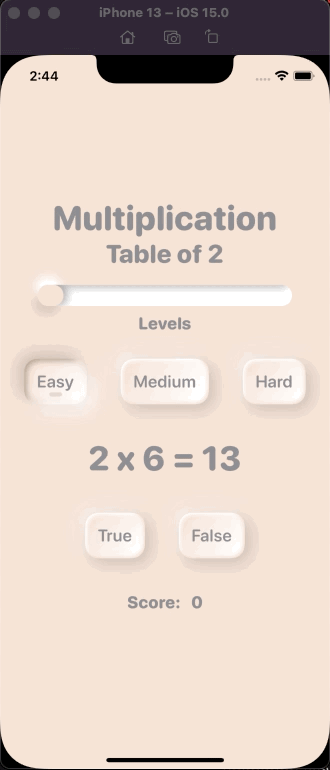

# Edutainment

## Goal

Edutainment - Multiplication game from tables of 1-20

## Changelog

* Neumorphism
  * Button
  * Slider
* Animation
  * withAnimation
    * .interpolatingSpring
    * .easeInOut
      * .repeatCount
      * .delay
      * .repeatForever
    * .easeOut
    * .easeIn
    * .default
    * .spring
  * .animation(value:)
  * .scaleEffect
  * .rotation3DEffect
  * .rotationEffect
  * .transition
    * .scale
    * .asymmetric
    * custom modifier
  * .gesture
    * DragGesture