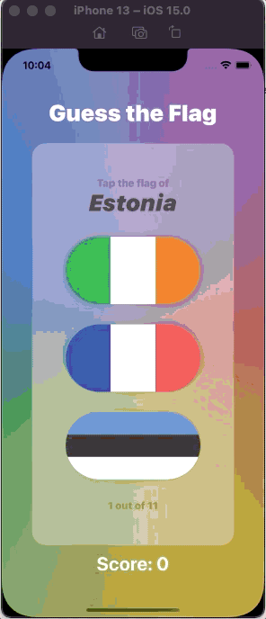

# GuessTheFlag

## Goal

Guess The Flag - 11 flags to guess

## Concept Changelog

* Form, Section, Group
* ZStack, HStack, VStack
* Text, Button, .alert, Image
* Colors (backgroundColor, foregroundColor)
* Font styling
* Frames
* Gradients: LinearGradient, RadialGradient, AngularGradient
* .onAppear, .onChange
* withAnimation(Animation.spring(...)) to show the correct answer