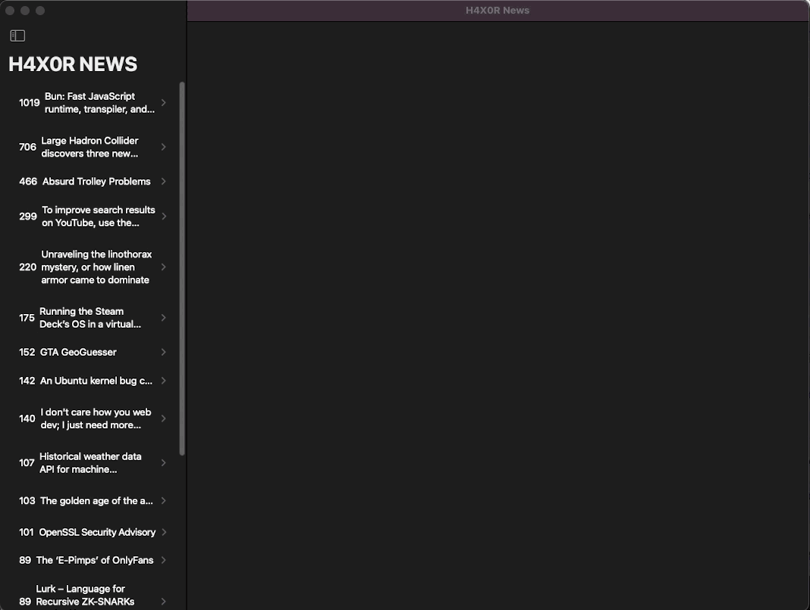

# H4X0R NEWS

## iPhone 13

## MacOS

## Goal

Show front page of hacker news in SWIFT UI + WebKit

## Changelog

* Learn to work with `SwiftUI Lists and the Identifiable Protocol`
* Use a `Navigation View` to navigate between the List and a detail view
* Advanced State Management using the `Observer Design Pattern`
* Learn to `incorporate a UIKit component into SwiftUI by using WebKit` to display web pages in your app 
* Enabling MacOS support