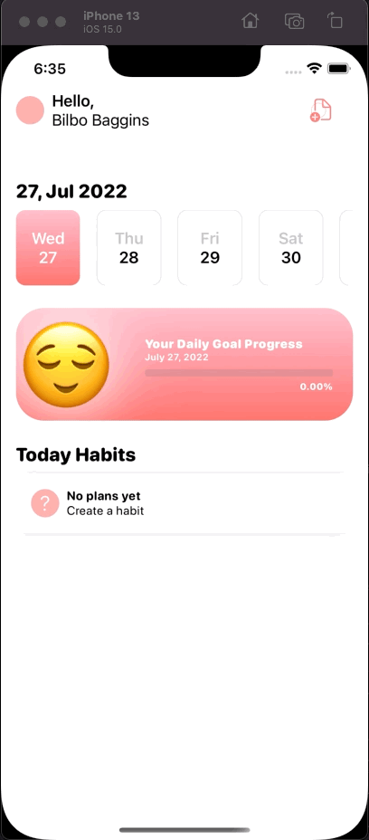
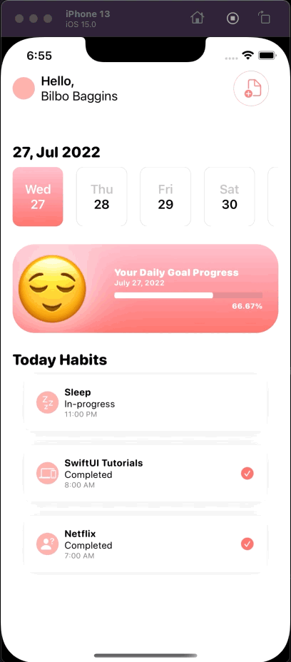

# HabitTracker

## Goal

HabitTracker - Track daily habits

Inspired from [this Dribbble Design](https://dribbble.com/shots/17349871-Habit-Tracker-App-Design)

## Changelog:
* List of habits
* Add a habit (daily or by date range)
* Filter habits by date
* Monitor percentage completion of daily habits
* Complete a habit
* Persisting Data

## To do / For enhancement: 
- Edit/Delete Habit
- Local Notifications
- Sort Habits by trigger time