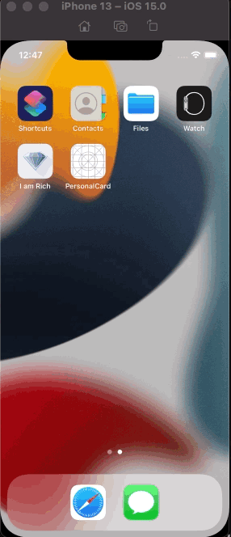

# PersonalCard

## Goal

Create a static one page app to demonstrate basic Swift UI

## Changelog

* How to create a SwiftUI project
* What is Live Preview and toggling on/off Canvas
* How to show Info.plist
* How to create a Launch Screen.storyboard (better to use images than texts with custom fonts)
* How to import custom fonts and use them
* Basic SwiftUI declarative programming
* ZStack, VStack, HStack, Text, Image, Overlays, Colors and RoundedRectangle and their attributes
* How to embed and create Subview file for reusable objects
* How to setup and check preview of a Subview