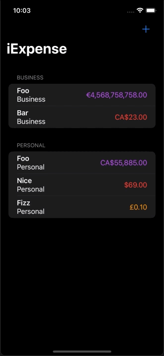

# iExpense


## Goal

iExpense - expense tracker (Add/Delete Business/Personal expenses in multiple currencies)

## Changelog

* `ObservableObject, @Published, @StateObject, @ObservedObject` for class's state
  <details>
  <summary>In this example, our state is now living outside and not in a @State private var in our ContentView struct</summary>

  ```swift
    class User: ObservableObject { // inherited ObservableObject
        @Published var firstName = "Bilbo" // properties that can be observed outside this class
        @Published var lastName = "Baggins" // publishes change announcements automatically.
    }

    struct ContentView: View {
        @StateObject private var user = User() // watches for those announcements and refreshes any views using the object observable.

        var body: some View {
            VStack {
                Text("Your name is \(user.firstName) \(user.lastName).")

                TextField("First name", text: $user.firstName)
                TextField("Last name", text: $user.lastName)
            }
        }
    }
  ```
  </details>

  <details>
  <summary>on the otherhand, @ObservedObject is used to take note that an existing ObservableObject has been passed as a parameter, initializer or a property of a struct and is now binded, any update you do to that object will update the parent view and the values of it</summary>

  ```swift
    struct AddView: View {
        @State private var name = ""
        @State private var type = "Personal"
        @State private var amount = 0.0
        @ObservedObject var expenses: Expenses

        let types = ["Business", "Personal"]

        var body: some View {
            NavigationView {
                Form {
                    TextField("Name", text: $name)

                    Picker("Type", selection: $type) {
                        ForEach(types, id: \.self) {
                            Text($0)
                        }
                    }

                    TextField("Amount", value: $amount, format: .currency(code: "USD"))
                        .keyboardType(.decimalPad)
                }
                .navigationTitle("Add new expense")
                .toolbar {
                    Button("Save") {
                        let item = ExpenseItem(name: name, type: type, amount: amount)
                        expenses.items.append(item)
                    }
                }
            }
        }
    }

    struct AddView_Previews: PreviewProvider {
        static var previews: some View {
            AddView(expenses: Expenses())
        }
    }
  ```
  </details>

* `.sheet and @Environment`'s .dismiss

  <details>
    <summary>In this example, we use an easy way to show another screen and dismiss</summary>

    ```swift
      struct SecondView: View {
        @Environment(\.dismiss) var dismiss // then use dismiss
        // Environment has all sorts of useful data from the device that can be used in any logic

        var body: someView {
          Button("Dismiss sheet") {
            dismiss()
          }
        }
      }

      struct ContentView: View {
          @State private var showingSheet = false

          var body: some View {
              Button("Show Sheet") {
                  showingSheet.toggle()
              }
              .sheet(isPresented: $showingSheet) { // .sheet is basically a NavigationView + Segue modifier in swiftui, which is waaaay easier but this is presented modally
              // this shows SecondView as a modal from bottom to top
                  SecondView()
              }
          }
      }
    ```
  </details>

* `.onDelete and toolbar`'s EditButton
  <details>
    <summary>In this example we show how to, swipe to delete, or tap edit button and delete items</summary>

    ```swift
    struct ContentView: View {
        @State private var numbers = [Int]()
        @State private var currentNumber = 1

        var body: some View {
            VStack {
                List { // List of Numbers
                    ForEach(numbers, id: \.self) {
                        Text("Row \($0)")
                    }
                    // built in modifier: deletes a row by short and long swipe
                    // in storyboard/uikit, you have to make this on your own or download a cocoapod package/library
                    .onDelete(perform: removeRows)
                }

                Button("Add Number") {
                    numbers.append(currentNumber)
                    currentNumber += 1
                }
            }
            .toolbar {
                // built in edit button in iOS
                // will let you edit a row depending on what you've activated
                // in this example, only delete can be done
                EditButton()
            }
        }
        // we need this function for the onDelete modifier to work
        func removeRows(at offsets: IndexSet) {
            numbers.remove(atOffsets: offsets)
        } 
    }
  ```
  </details>

* `UserDefaults and @AppStorage`
  <details>
    <summary>Persisting Data with UserDefaults</summary>

    ```swift
      struct ContentView: View {
          // getting value of integer saved Tap
          // can read and write data so that we can save settings and more instantly.
          @State private var tapCount = UserDefaults.standard.integer(forKey: "Tap")

          var body: some View {
              Button("Tap count: \(tapCount)") {
                  tapCount += 1
                  // setting value of integer saved Tap
                  UserDefaults.standard.set(self.tapCount, forKey: "Tap")
              }
          }
      }
    ```
  </details>

  <details>
    <summary>Persisting Data with UserDefaults wrapper @AppStorage</summary>

    ```swift
      struct ContentView: View {
          // getting value of integer saved Tap
           @AppStorage("tapCount") private var tapCount = 0

          var body: some View {
              Button("Tap count: \(tapCount)") {
                  tapCount += 1
              }
          }
      }
    ```
  </details>

* `Codable (Encodable/Decodable)`
  <details>
    <summary>Encodable: persisting much complex data type, in this case in JSON</summary>

    ```swift
      struct User: Codable { // can convert Swift objects into JSON and back with almost no code from us.
          let firstName: String
          let lastName: String
      }

      struct ContentView: View {
          @State private var user = User(firstName: "Taylor", lastName: "Swift")

          var body: some View {
              Button("Save User") {
                  let encoder = JSONEncoder() // if you want to decode, use JSONDecoder
                  
                  // data is in Data type
                  if let data = try? encoder.encode(user) { // if you want to decode, use encoder.decode
                      UserDefaults.standard.set(data, forKey: "UserData") // if decoding, no need for this, but assign the value back to state
                  }
              }
          }
      }
    ```
  </details>

* `Identifiable protocol`
  <details>
    <summary>creating an ID for a ExpenseItem Struct using UUID, before iterating through an array of ExpenseItem in a List</summary>

    ```swift
     struct ExpenseItem: Identifiable {
        let id = UUID()
        let name: String
        let type: String
        let amount: Double
    }
    ```
  </details>

* `IndexSet`
* `CaseIterable`